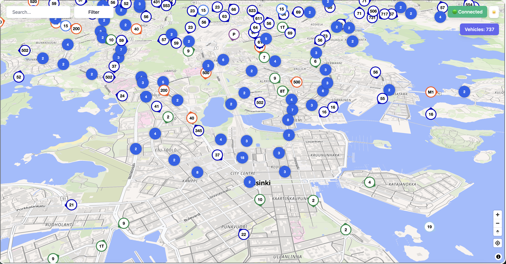
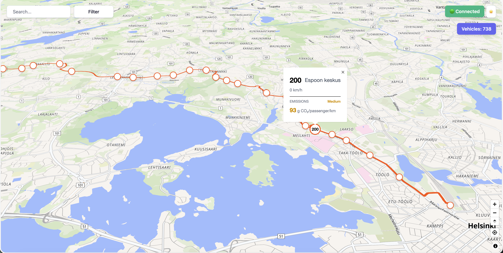
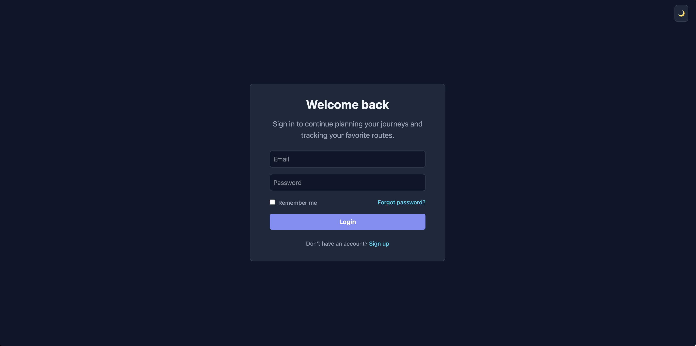
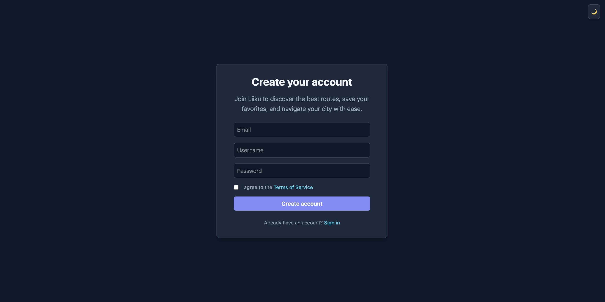
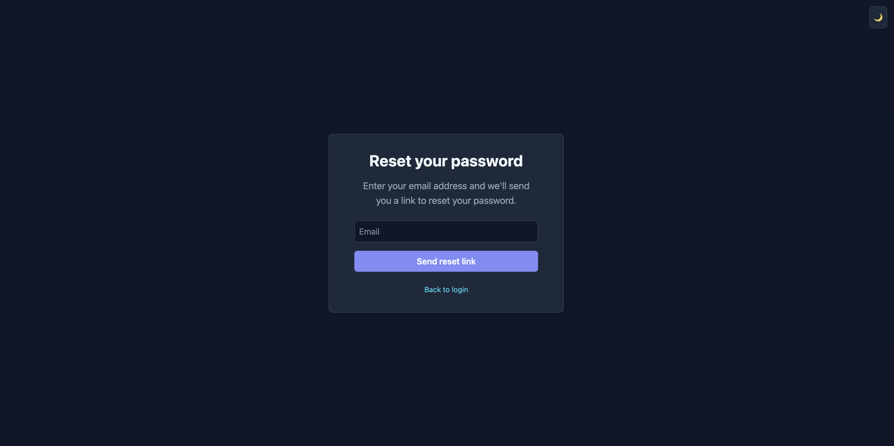
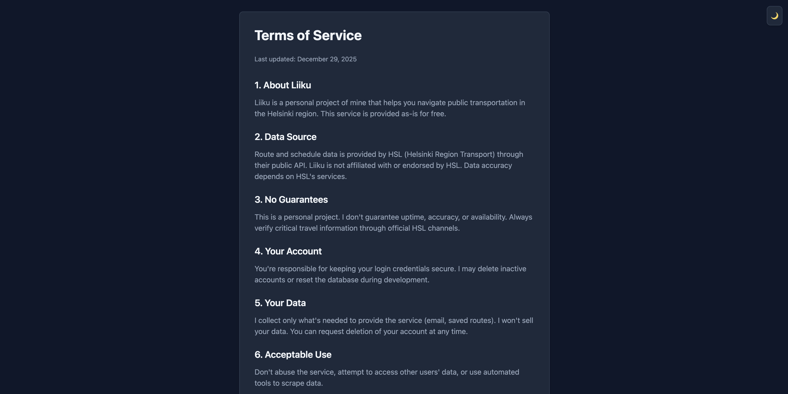

# liiku-client

A real-time public transit visualization application for Helsinki metropolitan area built with React, TypeScript and Maplibre GL JS.

## Table of Contents

- [Overview](#overview)
- [Features](#features)
- [Tech Stack](#tech-stack)
- [Project Structure](#project-structure)
- [Getting Started](#getting-started)
  - [Prerequisites](#prerequisites)
  - [Installation](#installation)
  - [Scripts](#scripts)
- [Configuration](#configuration)
  - [Environment Variables](#environment-variables)
  - [Map Configuration](#map-configuration)
- [Roadmap](#roadmap)
  - [Planned Features](#planned-features)
  - [Performance Optimizations](#performance-optimizations)
- [Acknowledgments](#acknowledgments)

## Overview

liiku-client provides an interactive map interface for tracking public transport vehicles in real-time. The application displays buses, trams, lightrails, metros, trains and ferries with live position updates, route visualization with polylines and detailed vehicle information popups.

## Screenshots

<details>
<summary style="font-weight:bold">Click to view screenshots</summary>

### Main Map View



### Route Visualization & Vehicle Popup



### Stop Details Popup


### Login



### Sign Up



### Password Reset



### Terms of Service



</details>

## Features

- **Real-time vehicle tracking** — Live position updates with smooth animations
- **Clustered markers** — Viewport based grouping of nearby vehicles at lower zoom levels
- **Route visualization** — Display route lines when selecting a vehicle
- **Vehicle type indicators** — Color-coded markers by transport mode (bus, tram, lightrail, metro, train, ferry)
- **Direction indicators** — Vehicle bearing displayed on markers
- **Interactive popups** — Detailed vehicle and route information on selection
- **Custom map styling** — Clean, purpose-built map style for optimized transit data and readability

## Tech Stack

| Category   | Technology                             |
| ---------- | -------------------------------------- |
| Framework  | React                                  |
| Language   | TypeScript                             |
| Build Tool | Vite                                   |
| Mapping    | MapLibre GL JS, @vis.gl/react-maplibre |
| Clustering | Supercluster                           |
| Styling    | tailwindCSS                            |
| Data       | Digitransit GTFS-RT API                |

## Project Structure

```
public/
└── screenshots/                      # Screenshots of the application
└── styles/
    └── map.json                      # Custom MapLibre style-file
src/
├── components/
|   ├── auth/
│   │   ├── Login.tsx                 # Login form
│   │   ├── ResetPassword.tsx         # Password reset request page
│   │   ├── Signup.tsx                # Signup form
│   │   ├── Terms.tsx                 # Terms of Service page
│   ├── map/
│   │   ├── ClusterMarker.tsx         # Clustered marker component
│   │   ├── Map.tsx                   # Map container
│   │   ├── MapContent.tsx            # Markers, popups, and layers
│   │   └── RouteLineLayer.tsx        # Route polyline layer
│   │   └── StopMarker.tsx            # Individual stop marker
│   │   └── StopPopupContent.tsx      # Individual stop popup
│   │   ├── VehicleMarker.tsx         # Individual vehicle marker
│   │   └── VehiclePopupContent.tsx   # Route polyline layer
|   ├── Filter.tsx                    # Route filtering
|   ├── Layout.tsx                    # Main application layout wrapper
|   ├── Search.tsx                    # Route search functionality
|   ├── ThemeToggle.tsx               # Dark/light mode theme switcher
├── hooks/
│   ├── useVehicles.ts                # Vehicle data fetching
│   ├── useVehicleAnimation.ts        # Smooth position interpolation
│   ├── useClustering.ts              # Marker clustering logic
│   └── useRouteShape.ts              # Route geometry fetching
├── services/
│   ├── websocketService.ts           # Websocket connector
├── utils/
│   ├── animation.ts                  # Vehicle movement calculator
│   ├── constants.ts                  # Configuration constants
│   ├── types.ts                      # TypeScript type definitions
│   └── vehicleColors.ts              # Vehicle type color mapping
├── App.tsx                           # Root component
└── index.css                         # Global styles
├── main.tsx                          # Application entry point

```

## Getting Started

### Prerequisites

- [Node.js](https://nodejs.org/) (v18 or newer recommended)
- [npm](https://www.npmjs.com/), [yarn](https://yarnpkg.com/) or [pnpm](https://pnpm.io/)

### Installation

```sh
# Clone the repository
git clone https://github.com/your-username/liiku-client.git
cd liiku-client

# Install dependencies
npm install

# Start development server
npm run dev
```

The application will be available at [http://localhost:5173](http://localhost:5173).

### Scripts

| Command           | Description                              |
| ----------------- | ---------------------------------------- |
| `npm run dev`     | Start development server with hot reload |
| `npm run build`   | Build for production                     |
| `npm run preview` | Preview production build locally         |
| `npm run lint`    | Run ESLint                               |

## Configuration

### Environment Variables

Create a `.env` file in the project root:

```env
VITE_API_URL=your_api_url
```

### Map Configuration

- **Map style**: `public/styles/map.json` (editable with [Maputnik](https://maputnik.github.io/))
- **Default center**: Helsinki city center, configurable in `src/utils/constants.ts`

## Roadmap

### Planned Features

- [ ] Filter controls for route numbers, directions, and vehicle types
- [ ] Search functionality for routes and stops
- ~~[x] Dark mode with localStorage persistence~~
- [ ] User location tracking with nearest vehicle display
- ~~[x] Follow mode for auto-centering on selected vehicles~~
- [ ] Favorites system for bookmarking routes
- ~~[x] Stops shown as markers on route lines~~
- [ ] 3D vehicle models at high zoom levels

### Performance Optimizations

- [ ] Route and stop data caching
- [ ] Service worker for offline support

## Acknowledgments

- [Digitransit](https://digitransit.fi/) for providing the public transit API
- [MapLibre](https://maplibre.org/) for the open-source mapping library
- [HSL](https://www.hsl.fi/) for Helsinki region transit data
